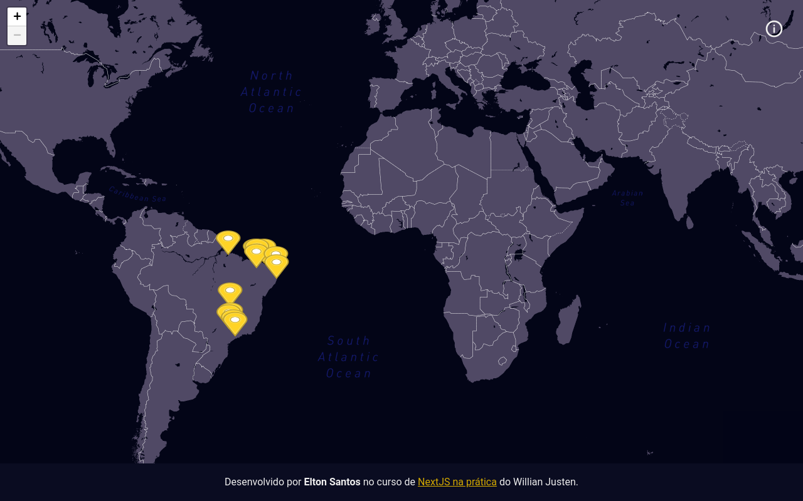
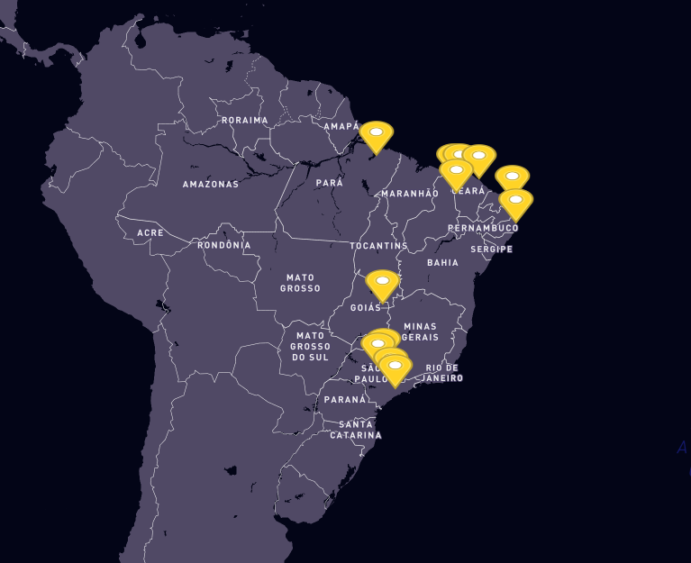

<h1 align="center">
    <b>My Trips</b>
</h1>

  <a href="#-tecnologias">Tecnologias</a>&nbsp;&nbsp;&nbsp;|&nbsp;&nbsp;&nbsp;
  <a href="#-projeto">Projeto</a>&nbsp;&nbsp;&nbsp;|&nbsp;&nbsp;&nbsp;
  <a href="#-próximos-passos">Próximos passos</a>&nbsp;&nbsp;&nbsp;

 

  

## 🚀 Tecnologias

Esse projeto foi desenvolvido com as seguintes tecnologias:

- [NextJS](https://nextjs)
- [Styled-components](https://styled-components.com/)
- [TypeScript](https://www.typescriptlang.org/)
- [React Leaflet](https://react-leaflet.js.org/)
- [GraphQL](https://graphql.org/)
- [GraphCMS](https://graphcms.com/)
- [Jest](https://jestjs.io/)
- [React Testing Library](https://testing-library.com/docs/react-testing-library/intro)
- [Eslint](https://eslint.org/)
- [Prettier](https://prettier.io/)
- [Husky](https://github.com/typicode/husky)

## 💻 Projeto

Aplicação desenvolvida no curso de [**Aprenda NextJS, GraphQL e Leaflet na prática!**](https://www.udemy.com/course/aprenda-nextjs-na-pratica/) da Udemy do instrutor [**Willian Justen**](https://www.udemy.com/user/willian-justen-de-vasconcellos/). 💜

 [**My Trips**](https://my-trips-eltonsantos.vercel.app/) é uma aplicação simples, objetiva e totalmente responsiva, podendo ser acessada de qualquer disposivo móvel ou desktop, desenvolvida para registrar as cidades que já visitei.

 As páginas são cadastradas através do gerenciador de conteúdo [GraphqCMS](https://graphcms.com/) de modo bem simples e similar a criação de páginas com o Wordpress, por exemplo.

  

## 🐾 Próximos passos

- [ ] Centralizar e aproximar o zoom no Brasil; 😍
- [ ] Colocar o marcador de uma cor para as cidades que visitei e outra cor para as cidades que pretendo visitar; ⛳
- [ ] E muito mais... ❤💪🏼

## 👨🏻‍💻 Autor

<h3 align="center">
  
   
  <strong>Elton Santos</strong> 🚀
   
   

 

  

 

Feito com ❤️ por Elton Santos 👋🏽 [Entre em contato!](https://www.linkedin.com/in/eltonmelosantos/)

</h3>
